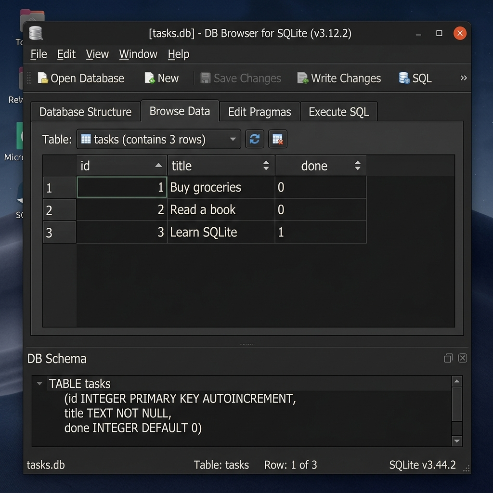

# FlyrankAI - SQLite Tasks Management API

A FastAPI application backed by a persistent SQLite database (`tasks.db`), demonstrating full CRUD capabilities, Clean Architecture, and direct SQL execution.

---

## 🚀 Quick Start (One Command)

To run the application on a fresh clone (or after deleting `tasks.db`), run:

```bash
uv run uvicorn main:app --port 8000
```

> **Note**: The application automatically creates the `tasks.db` database file, initializes the `tasks` table schema, and seeds 3 initial tasks on first startup. No manual setup is required!

---

## 💡 Why SQLite Was Chosen

- **Single-File Storage**: The entire database resides in a single, lightweight file (`tasks.db`).
- **Zero Setup**: Uses Python's built-in `sqlite3` standard library — no separate database server or Docker daemon installation is needed to run.
- **Survives Restarts**: Data persists reliably across application restarts, ensuring true database durability.

---

## 📁 Database Location & Setup

- **File Path**: `tasks.db` (located at the root of the project).
- **Auto-Initialization**: Opening/connecting to `tasks.db` on app startup automatically creates the file and schema if it does not exist yet.
- **Version Control (`.gitignore`)**: `tasks.db` is `.gitignore`d so that each developer or stranger who clones the repository gets a clean, fresh database auto-seeded with the 3 default tasks.

---

## 🛠️ API Endpoints (CRUD)

| Method | Endpoint | Description | SQL Query Executed |
| :--- | :--- | :--- | :--- |
| `GET` | `/tasks` | List all tasks | `SELECT * FROM tasks` |
| `GET` | `/tasks/{id}` | Get task by ID | `SELECT * FROM tasks WHERE id = ?` |
| `POST` | `/tasks` | Create a new task | `INSERT INTO tasks (title, done) VALUES (?, ?)` |
| `PUT` | `/tasks/{id}` | Update task title and done status | `UPDATE tasks SET title = ?, done = ? WHERE id = ?` |
| `DELETE` | `/tasks/{id}` | Delete task by ID | `DELETE FROM tasks WHERE id = ?` |

---

## 🔍 Database Inspection & Direct SQL Experiment

### DB Browser Screenshot
Below is a screenshot of `tasks.db` opened directly inside **DB Browser for SQLite**:



### Direct SQL Query Executed
Command run directly in DB Browser's **Execute SQL** tab:

```sql
SELECT COUNT(*) FROM tasks;
```

**Result Output**: Returned `3`, confirming there are 3 tasks stored live inside `tasks.db`.
