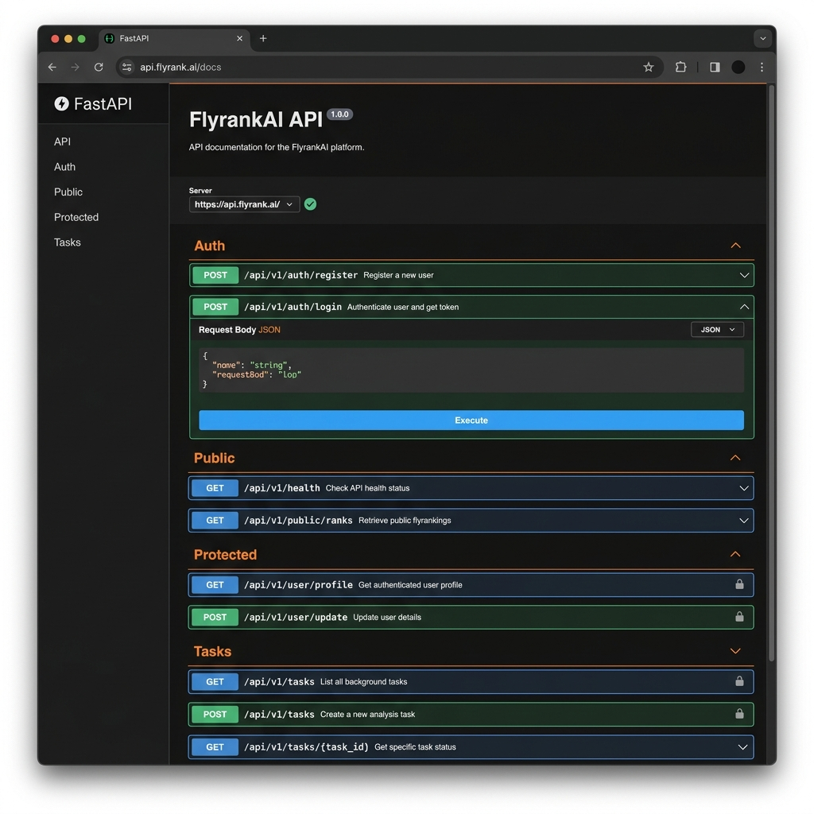

# FlyrankAI - FastAPI Supabase Auth & SQLite Tasks API

A production-ready Python FastAPI application demonstrating full-stack backend authentication with **Supabase Auth**, JWT bearer token verification via reusable middleware dependencies, and persistent task management backed by **SQLite**.

---

## 📌 Project Overview

This project provides a secure, modular REST API featuring:
- **Authentication**: User sign up (`POST /auth/signup`), password login (`POST /auth/login`), and global logout (`POST /auth/logout`).
- **Reusable Auth Guard (`get_current_user`)**: Centralized FastAPI dependency enforcing live token validation with Supabase Auth.
- **Public & Protected Gates**: Public endpoints alongside locked endpoints requiring `Authorization: Bearer <token>`.
- **Database Persistence**: SQLite database (`tasks.db`) with automatic table creation, single-run seeding, and parameterized queries.

---

## ⚙️ Environment Variables Setup

1. Copy the template file `.env.example` to create your local `.env` file:
   ```bash
   cp .env.example .env
   ```

2. Open `.env` and fill in your Supabase credentials:
   ```env
   SUPABASE_URL=https://your-project.supabase.co
   SUPABASE_KEY=your-supabase-anon-key
   PORT=3000
   ```

> ⚠️ **Security Warning**: Never commit your `.env` file or Supabase keys to version control. The `.env` file is strictly listed in `.gitignore`.

---

## 🚀 One Command to Run

Install dependencies and start the server with a single command:

```bash
uv run python main.py
```

The application will start on `http://localhost:3000` (or the port configured in `.env`).

---

## 📖 API Reference Table

### Authentication Endpoints
| Method | Endpoint | Description | Auth Required |
| :--- | :--- | :--- | :---: |
| `POST` | `/auth/signup` | Register a new user | ❌ No |
| `POST` | `/auth/login` | Sign in with email & password | ❌ No |
| `POST` | `/auth/logout` | Sign out current session | ✅ Yes (`Bearer token`) |

### Gate Endpoints
| Method | Endpoint | Description | Auth Required |
| :--- | :--- | :--- | :---: |
| `GET` | `/public/info` | Public welcome information | ❌ No |
| `GET` | `/protected/profile` | View verified user profile | ✅ Yes (`Bearer token`) |
| `GET` | `/protected/dashboard` | View protected dashboard | ✅ Yes (`Bearer token`) |

### Task Management Endpoints (SQLite)
| Method | Endpoint | Description | Auth Required |
| :--- | :--- | :--- | :---: |
| `GET` | `/tasks` | List all tasks | ❌ No |
| `GET` | `/tasks/{id}` | Fetch task by ID | ❌ No |
| `POST` | `/tasks` | Create a new task | ❌ No |
| `PUT` | `/tasks/{id}` | Update task title and status | ❌ No |
| `DELETE` | `/tasks/{id}` | Delete task by ID | ❌ No |

---

## 📸 Interactive API Documentation (Swagger UI)

Access the interactive OpenAPI Swagger UI at `http://localhost:3000/docs`:



---

## 🧪 Testing Auth Flow with cURL

1. **Public Info**:
   ```bash
   curl -i http://localhost:3000/public/info
   ```

2. **Unauthenticated Profile Access (Fails with 401)**:
   ```bash
   curl -i http://localhost:3000/protected/profile
   ```

3. **Authenticated Profile Access (Returns 200)**:
   ```bash
   curl -i -H "Authorization: Bearer <YOUR_ACCESS_TOKEN>" http://localhost:3000/protected/profile
   ```
