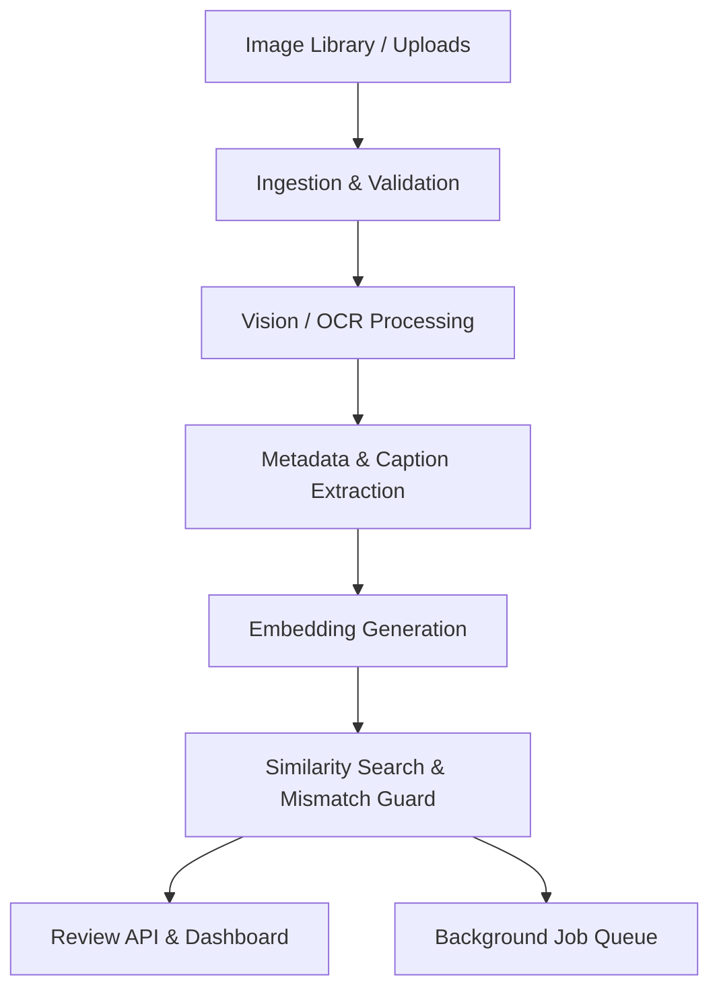

# architecture.md — Kiến trúc hệ thống cho Capstone - AI Image Understanding & Content Matching Engine

## 1. Mô hình tổng thể

## 2. Thành phần chính
| Thành phần | Vai trò | Ghi chú |
| :--- | :--- | :--- |
| Ingestion | Nhận file ảnh từ upload hoặc batch job | Chuẩn hóa và validate schema |
| Vision/OCR | Trích xuất caption, tags, attributes, confidence | Có thể dùng Gemini/Ollama local |
| Embedding Layer | Tạo vector cho caption và post text | Dùng cosine similarity |
| Mismatch Guard | Chặn kết quả sai và trả reject reason | Là phần chiến lược cốt lõi |
| Review API | Cho phép approve/reject và ghi nhận feedback | Hỗ trợ quality loop |
| Background Queue | Xử lý bất đồng bộ, retry, cost tracking | Giảm latency và tăng độ tin cậy |

## 3. Luồng nghiệp vụ cốt lõi
1. Ingestion Service: nhận ảnh từ thư viện mẫu hoặc upload.
2. Preprocess: resize, normalize, metadata extraction.
3. Vision/OCR Layer: trả về JSON metadata có confidence.
4. Embedding Layer: tạo vector cho caption và post text.
5. Similarity Search: xếp hạng ảnh phù hợp nhất.
6. Mismatch Guard: chặn trường hợp kết quả không đủ chất lượng.
7. Review API: cập nhật approve/reject và lưu lý do.

## 4. Mục tiêu chất lượng
- Tỉ lệ false match phải thấp và có cảnh báo rõ ràng.
- Mỗi batch job phải có retry, logging và cost tracking.
- Mỗi thay đổi lớn phải kèm verification và cập nhật specs.
