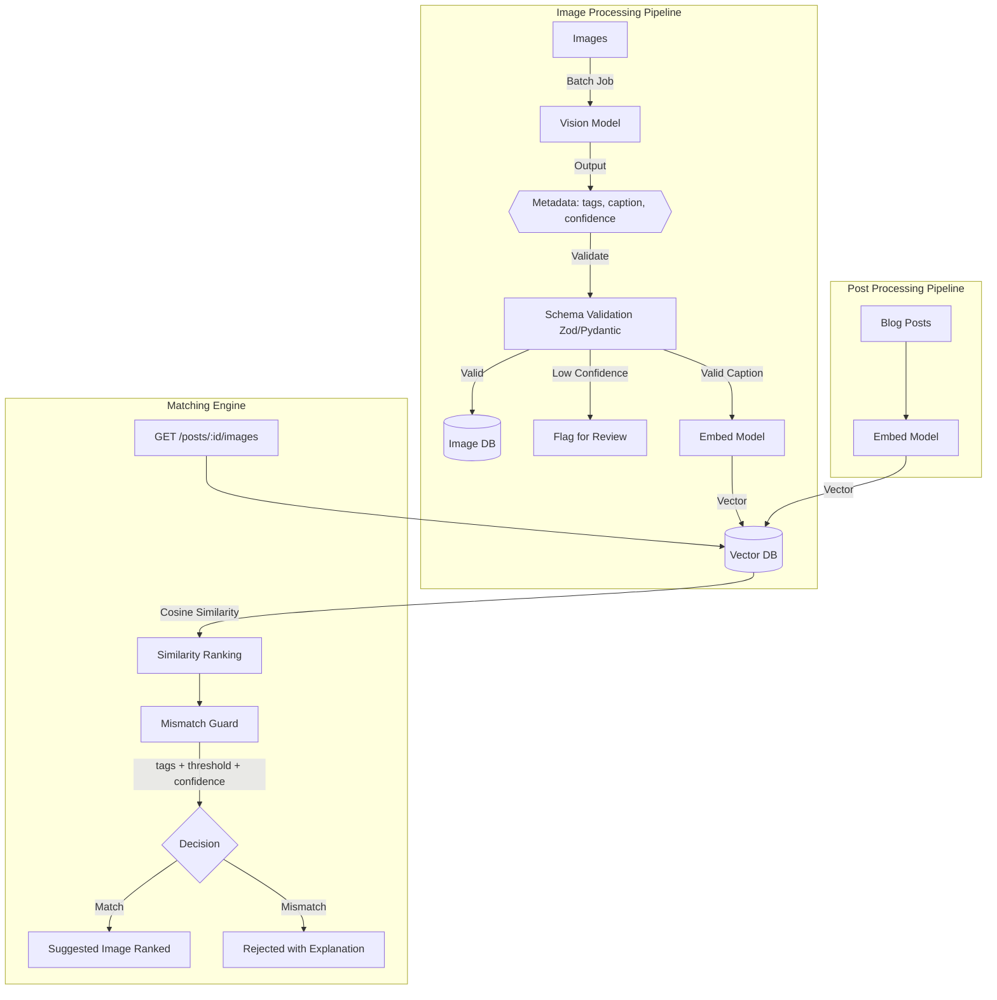

# Architecture: AI Image Understanding & Content Matching Engine

## 1. System Overview

The system consists of two parallel data streams (Images and Posts) that meet at the matching and ranking layer. The architecture relies heavily on asynchronous processing for the AI-heavy tasks, ensuring the main request paths remain fast and reliable.

 
## 2. Core Components

### 2.1. The AI Processor (Background Worker)
- **Role:** Handles the slow, bulk work of calling the Vision API and Embedding API.
- **Mechanism:** When a new image is added, an event is placed on a durable queue. A background worker picks it up, calls the Vision API to extract tags and captions, validates the output, and then calls the Embedding API.
- **Resilience:** Implements retries with exponential backoff.
- **Observability:** Logs the cost of each AI call directly against the processing task.

### 2.2. Schema Validation Layer
- **Role:** The boundary between the AI model and our database.
- **Mechanism:** It treats the AI output as untrusted user input. If the JSON structure is invalid, it throws a validation error which triggers a retry in the background worker. If confidence is below the threshold, it accepts the data but flags the record status as `NEEDS_REVIEW`.

### 2.3. Mismatch Guard
- **Role:** Protects the user from hilariously bad AI mistakes (e.g., suggesting a wolf for a fox article).
- **Mechanism:** Acts as a filter AFTER semantic similarity ranking. Even if a "wolf" image has the highest semantic similarity score to a "fox" post in the vector space, the mismatch guard checks the categorical tags (e.g., `expected: fox`, `actual: wolf`) and vetoes the match.

## 3. Data Flow

1. **Ingestion:** Images uploaded -> Enqueued.
2. **Processing:** Worker dequeues -> Generates structured JSON -> Extracts caption -> Generates vector embedding -> Saves to DB.
3. **Querying:** User queries images for a post -> Post text is embedded -> Vector DB returns top N closest vectors -> Mismatch Guard filters top N -> Valid matches are returned.
4. **Review:** User interacts with the Review API to approve or reject the final suggestions, providing a human-in-the-loop fallback for edge cases.
