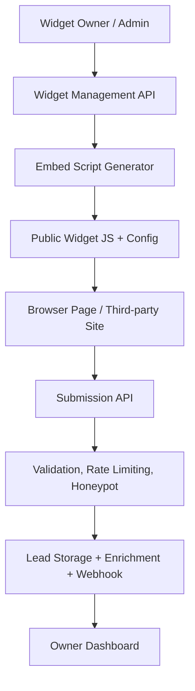

# architecture.md — Kiến trúc hệ thống cho Capstone - Embeddable Widget & Lead-Capture Platform

## 1. Mô hình tổng thể

## 2. Thành phần chính
| Thành phần | Vai trò | Ghi chú |
| :--- | :--- | :--- |
| Widget Management API | CRUD widget và phân quyền tenant | Dữ liệu cách ly theo tenant |
| Embed Snippet Generator | Tạo script nhúng và config versioned | Dùng cache header phù hợp |
| Public Submission API | Nhận dữ liệu từ trang web ngoài | Cần CORS, validation và bảo mật |
| Abuse Protection | Rate limit, honeypot, spam filtering | Bảo vệ API nhận request công khai |
| Enrichment Layer | IP Geo fallback | Vẫn lưu thành công nếu provider lỗi |
| Dashboard | Trả về submissions và thống kê | Dữ liệu dễ kiểm tra cho owner |

## 3. Luồng nghiệp vụ cốt lõi
1. Widget owner tạo/sửa widget và lấy snippet.
2. Script nhúng được load trên trang website khách hàng.
3. Người dùng tương tác với form và gửi submission.
4. Backend validate input, rate limit và phát hiện spam.
5. System enrich dữ liệu bằng IP Geo fallback.
6. Submission được lưu và webhook/email gửi safe side effect.

## 4. Mục tiêu chất lượng
- API public phải luôn trả 4xx đúng cho input sai, không bị 500.
- Side effect lỗi không được làm fail submission.
- Multi-tenant isolation phải được kiểm thử nghiêm ngặt.
