# Architecture: Embeddable Widget & Lead-Capture Platform

## 1. System Overview

This system is built around three distinct request paths, separated by actors. It is designed to act as a resilient edge service that handles untrusted, high-volume public internet traffic while maintaining strict isolation for authenticated users.

```mermaid
graph TD
    %% Widget Owner Path
    subgraph Owner Path - Authenticated
        WO[Widget Owner] -->|Auth| API_MGT[Management API]
        API_MGT -->|Tenant Isolated| DB[(Widget DB)]
        API_MGT --> DASH[Dashboard API]
    end

    %% Customer Website Path
    subgraph Delivery Path - Cached & Public
        CW[Customer Website] -->|script tag| API_CONF[Config / JS Bundle API]
        API_CONF -->|Cached HTTP| CW
    end

    %% Website Visitor Path
    subgraph Submission Path - Hardened & Public
        VIS[Website Visitor] -->|POST CORS| SUB[Submission Endpoint]
        SUB --> VAL[Payload Validation]
        VAL --> RATE[Rate Limiter & Spam Check]
        RATE --> GEO[Geo Enrichment Chain]
        GEO -.->|Provider A fails| GEO_B[Provider B]
        GEO -->|Success or Fallback| DB_SUB[(Submission DB)]
        DB_SUB -->|Safe Side Effect| EMAIL[Confirmation Email/Webhook]
    end
```

## 2. Core Components

### 2.1. Authenticated Management API
- **Role:** Handles configuration and CRUD operations.
- **Pattern:** Strict multi-tenant data access. Every database query includes a `tenant_id` filter. No cross-tenant access is possible at the database access layer.

### 2.2. Fast Widget Delivery
- **Role:** Serves the actual widget code and its settings to the browser.
- **Pattern:** Acts like a mini-CDN. Returns highly cacheable responses (`Cache-Control: public, max-age=...`) to ensure that millions of page loads don't hammer the database.

### 2.3. Hardened Submission API
- **Role:** The front door for the public internet.
- **Boundaries & Defenses:**
  - **CORS:** Responds to `OPTIONS` preflight requests cleanly.
  - **Validation:** Strictly validates the JSON body length, types, and required fields.
  - **Rate Limiting:** Protects against bursts (e.g., 429 Too Many Requests if a single IP hits it 100 times in 10 seconds).
  - **Spam Filtering:** Checks for honeypot field presence.

### 2.4. Graceful Degradation Chain
- **Geo Enrichment:** When a submission arrives, it attempts to look up the IP address. If the primary geo provider times out or fails, it falls back to a secondary provider. If both fail, it logs the failure but *proceeds* to store the submission.
- **Side Effects:** Sending a webhook or an email after submission is executed asynchronously or wrapped in a try/catch. A failure here MUST NOT return a `500` to the user who just submitted the form. The main path (storing the data) must succeed.
