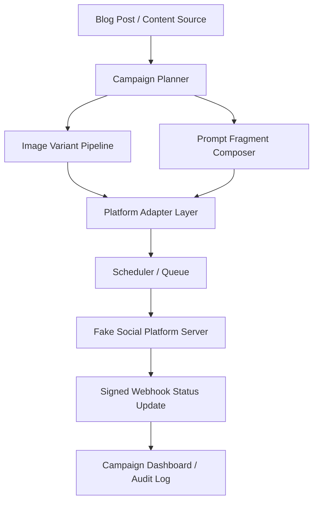

# architecture.md — Kiến trúc hệ thống cho Capstone - Multi-Platform Social Campaign Publisher

## 1. Mô hình tổng thể

## 2. Thành phần chính
| Thành phần | Vai trò | Ghi chú |
| :--- | :--- | :--- |
| Campaign Planner | Tạo campaign, content brief và target platform | Là entry point của workflow |
| Image Variant Pipeline | Tạo ảnh theo tỷ lệ và safe zone cho từng platform | Dùng sharp/Pillow |
| Prompt Fragment Composer | Ghép prompt từ shared brand voice + platform rules | Giảm duplicate prompt |
| Publisher Adapter | Gửi post đến fake platform và xử lý idempotency | Cần retry và rate-limit handling |
| Scheduler | Lên lịch và đảm bảo durable execution | Dùng queue/worker hoặc APScheduler |
| Webhook Handler | Xác thực chữ ký và cập nhật trạng thái | Cắt sai trạng thái nếu signature invalid |

## 3. Luồng nghiệp vụ cốt lõi
1. Tạo campaign từ nội dung gốc.
2. Sinh variant ảnh và caption theo từng nền tảng.
3. Tạo publish job và lưu vào queue/scheduler.
4. Adapter gửi bài đến fake platform với idempotency key.
5. Webhook đúng chữ ký cập nhật trạng thái queued/publishing/published/failed.

## 4. Mục tiêu chất lượng
- Không tạo bài đăng trùng trong mọi trường hợp retry hoặc duplicate request.
- Scheduler phải survive restart và không phát sinh duplicate job.
- Signature verification phải là gate chính cho webhook update.
