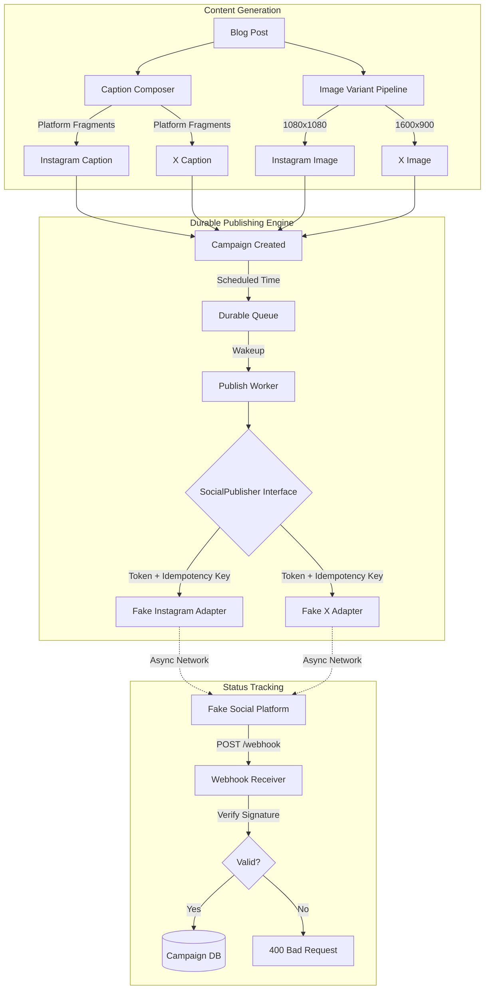

# Architecture: Multi-Platform Social Campaign Publisher

## 1. System Overview

This system turns a source blog post into multiple platform-specific social media posts. The architecture is heavily focused on the Adapter pattern to abstract away platform differences, and durable queues to handle the unreliability of networks.

## 2. Core Components

### 2.1. Image Variant Pipeline
- **Role:** Ensures media strictly conforms to platform specifications.
- **Mechanism:** Takes a source image, applies crop, resize, and safe-zone logic dynamically based on the target platform's requirements.

### 2.2. Social Publisher Adapter Layer
- **Role:** Hides the chaotic, varied APIs of social networks behind one clean internal interface.
- **Mechanism:** Implements a single interface (e.g., `publish(content, media, idempotencyKey)`). Both Instagram and X adapters implement this. Adding LinkedIn later would just mean adding a new adapter class without touching the core publishing loop.

### 2.3. Durable Scheduler
- **Role:** Ensures campaigns publish exactly on time, and survive server restarts.
- **Mechanism:** A persistent job store (e.g., Redis via BullMQ, or Postgres via APScheduler). If the worker crashes while processing a batch, the jobs remain in the queue and are retried upon restart.

### 2.4. Idempotency & Rate Limit Engine
- **Role:** Prevents double-posting.
- **Mechanism:** Every outbound request to a social network includes a unique idempotency key. If a request times out, the worker retries with the *same* key. The fake platform recognizes the key and returns the cached success response instead of creating a second post.
- **Rate Limits:** If the adapter encounters a `429`, it reads the `Retry-After` header, puts the job to sleep for that exact duration, and requeues it.

### 2.5. Webhook Trust Boundary
- **Role:** Maintains accurate campaign status.
- **Mechanism:** We never trust our own outgoing request for final status. A post is only marked `published` when the platform tells us via an HMAC-signed webhook. The receiver calculates the expected signature and compares it; if they mismatch, the payload is forged and immediately dropped.
