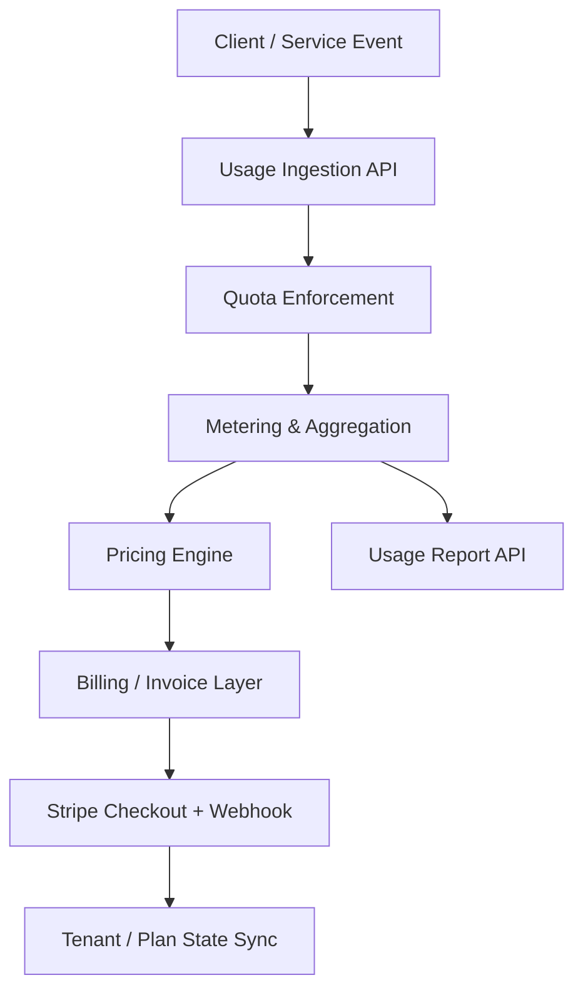

# architecture.md — Kiến trúc hệ thống cho Capstone - Usage Metering & Billing Engine

## 1. Mô hình tổng thể

## 2. Thành phần chính
| Thành phần | Vai trò | Ghi chú |
| :--- | :--- | :--- |
| Usage Ingestion | Nhận event và idempotency key | Đảm bảo không double-count |
| Quota Enforcer | Kiểm tra quota plan và trả 429/402 | Boundary cases rất quan trọng |
| Metering Engine | Aggregate theo tenant/plan/window | Dùng integer để lưu tiền |
| Pricing Engine | Tính chi phí từ token breakdown | Config-driven và testable |
| Billing Layer | Tạo invoice preview và sync plan/subscription | Kết nối Stripe |
| Webhook Handler | Xác thực chữ ký và dedupe event | Không cập nhật plan hai lần |

## 3. Luồng nghiệp vụ cốt lõi
1. Event được ghi với idempotency key.
2. Hệ thống kiểm tra quota trước khi xử lý tiếp.
3. Usage được aggregate theo tháng/tenant.
4. Pricing engine tính cost từ token type và config.
5. Billable state được sync sang Stripe subscription và tenant plan.

## 4. Mục tiêu chất lượng
- Không được ghi nhận event trùng với cùng idempotency key.
- Quota boundary phải đúng ở request thứ N và N+1.
- Stripe webhook phải xử lý deduplication và HMAC verification đầy đủ.
