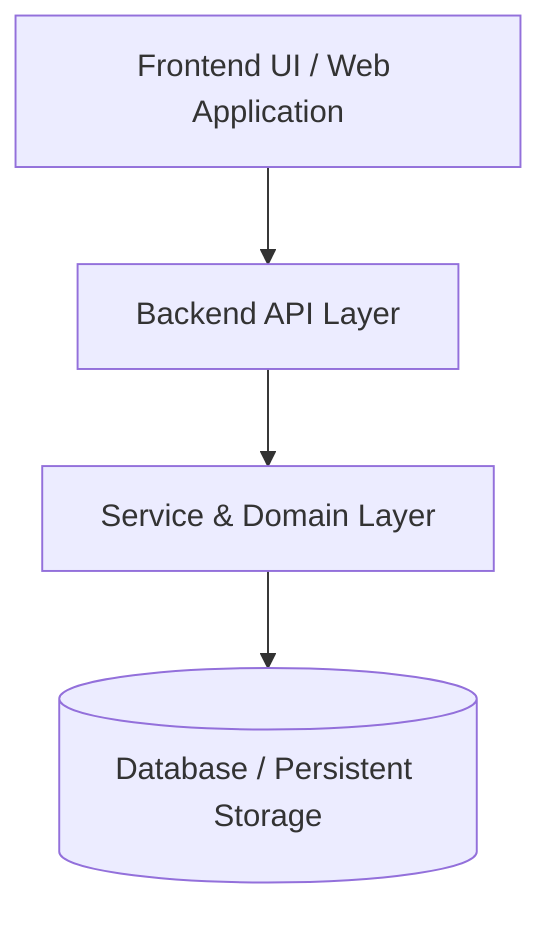

# 🏗️ docs/architecture.md — System Architecture & Live Code Mapping (Generic Template)

> Every component in this architectural document must point directly to live code using clickable Markdown links (*Tip 3*).

---

## 1. High-Level Architecture

---

## 2. Component Code Mapping (*Tip 3*)
| Component | File Path | Core Responsibility |
| :--- | :--- | :--- |
| **API Entrypoint** | `src/main.ext` | Routes HTTP requests and initializes dependencies. |
| **Domain Logic** | `src/services/` | Business logic and integrations. |
| **Data Access** | `src/db/` | Database queries and schema definitions. |

---

## 3. Performance & Caching Design (*Tip 5*)
- Document critical caching layers, latency boundaries, and external API rate limits here.
